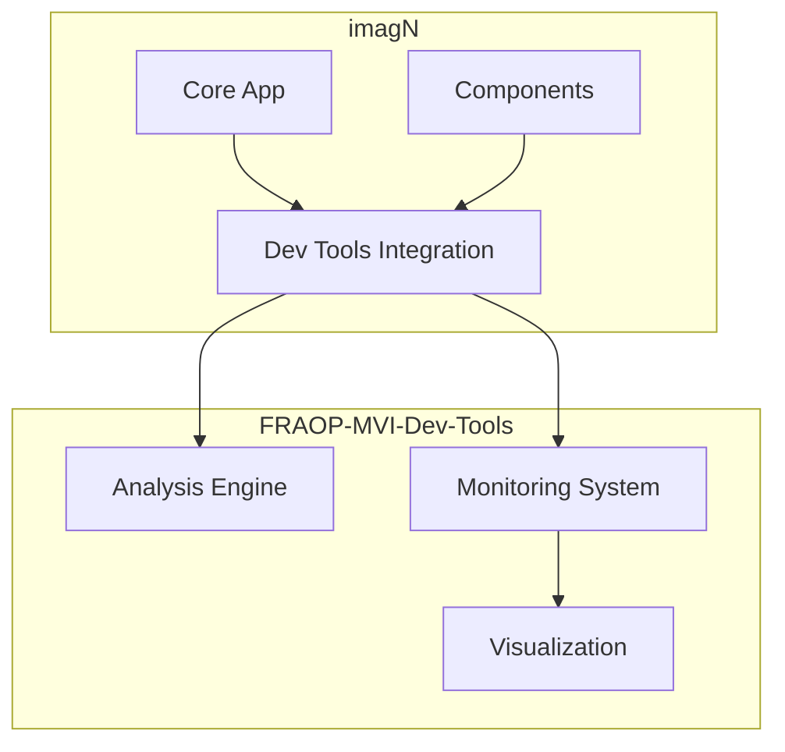

# Separation of Concerns: imagN and FRAOP-MVI-Dev-Tools

## Overview

This document outlines the clear separation of responsibilities between the imagN main application and the FRAOP-MVI-Dev-Tools module. It defines the boundaries, integration points, and independent concerns of each project.

## Project Boundaries

### FRAOP-MVI-Dev-Tools Responsibilities

1. **Prop Analysis**
   - Prop tracking and monitoring
   - Performance analysis
   - Pattern detection
   - Optimization recommendations

2. **Development Tools**
   - Real-time monitoring dashboard
   - Performance visualization
   - Debug utilities
   - Development mode features

3. **Analysis Engine**
   - Data collection
   - Metrics processing
   - Pattern analysis
   - Impact calculation

### imagN Responsibilities

1. **Core Application**
   - Image workflow management
   - User interface
   - Business logic
   - Data management

2. **Integration Points**
   - Dev tools initialization
   - Component tracking setup
   - Performance monitoring integration
   - Debug mode configuration

## Integration Architecture



## File Organization

### FRAOP-MVI-Dev-Tools
```
FRAOP-MVI-Dev-Tools/
├── src/
│   ├── core/          # Analysis engine
│   ├── components/    # Dev tool components
│   └── services/      # Monitoring services
├── context/
│   ├── frd/           # Dev tools requirements
│   └── architecture/  # Dev tools design
```

### imagN
```
imagN/
├── src/
│   ├── components/    # Application components
│   └── dev-tools/     # Integration code only
├── context/
│   ├── app/          # Application context
│   └── workflow/     # Business logic
```

## Data Flow Separation

### FRAOP-MVI-Dev-Tools Data
- Prop analysis results
- Performance metrics
- Pattern detection data
- Optimization suggestions

### imagN Data
- Application state
- User data
- Business logic
- Workflow configuration

## Integration Points

### 1. Initialization
```typescript
// In imagN
import { initDevTools } from 'fraop-mvi-dev-tools';

if (process.env.NODE_ENV === 'development') {
  initDevTools({
    target: document.getElementById('dev-tools-root'),
    features: ['monitoring', 'optimization']
  });
}
```

### 2. Component Tracking
```typescript
// In imagN
import { withPropTracking } from 'fraop-mvi-dev-tools';

const TrackedComponent = withPropTracking(MyComponent, {
  name: 'MyComponent',
  trackChildren: true
});
```

## Development Workflow

### FRAOP-MVI-Dev-Tools
- Independent version control
- Separate release cycle
- Own test suite
- Dedicated documentation

### imagN
- Uses dev tools as dependency
- Integration testing
- Configuration management
- Usage documentation

## Testing Strategy

### FRAOP-MVI-Dev-Tools Tests
- Unit tests for analysis engine
- Integration tests for monitoring
- Performance benchmarks
- Browser compatibility

### imagN Tests
- Integration with dev tools
- Configuration testing
- Performance impact
- Debug mode functionality

## Documentation Separation

### FRAOP-MVI-Dev-Tools Docs
- API documentation
- Integration guides
- Performance considerations
- Extension development

### imagN Docs
- Integration setup
- Configuration options
- Debug mode usage
- Performance tuning

## Version Control

### FRAOP-MVI-Dev-Tools Repository
- Core analysis engine
- Development tools
- Monitoring system
- Documentation

### imagN Repository
- Integration code
- Configuration
- Usage examples
- Performance tests

## Future Considerations

### FRAOP-MVI-Dev-Tools Evolution
- Enhanced analysis features
- Additional visualizations
- Plugin system
- Performance improvements

### imagN Integration
- Deeper integration
- Custom plugins
- Performance optimization
- Enhanced debugging 