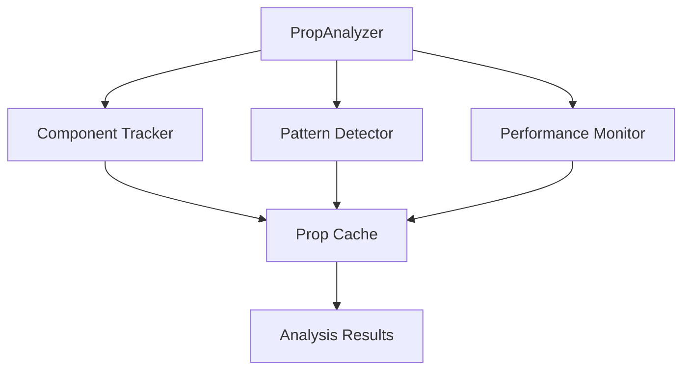
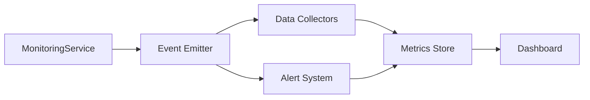
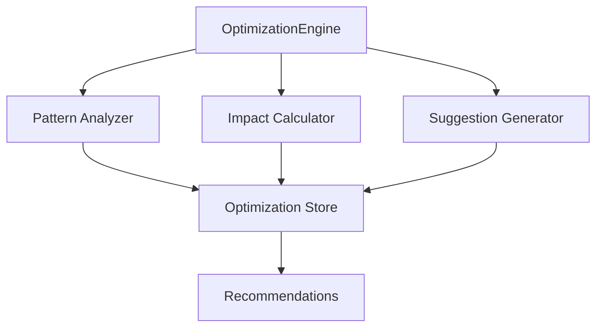
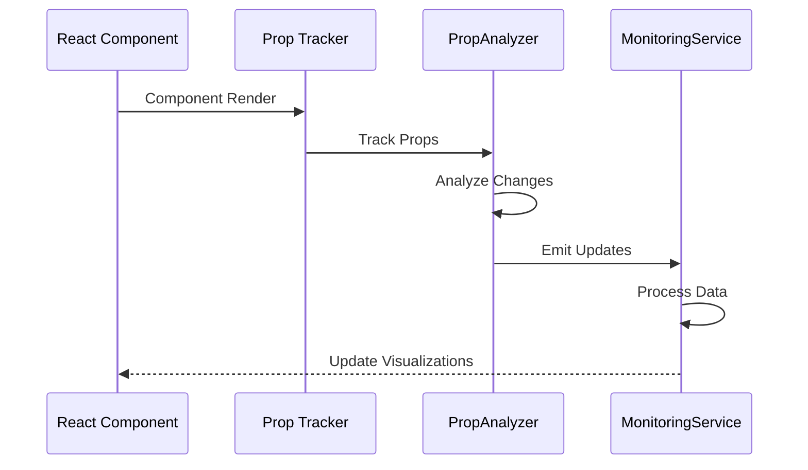
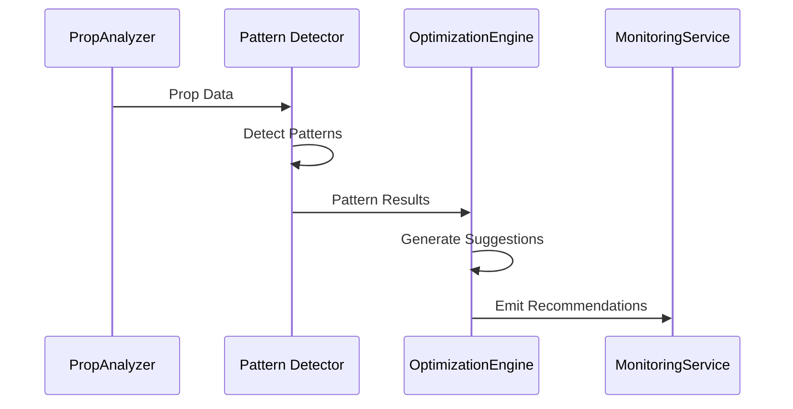

# FRAOP-MVI Dev Tools - System Architecture

## System Overview

The FRAOP-MVI Dev Tools is built on a modular architecture that emphasizes extensibility, performance, and ease of integration. The system is composed of several core subsystems that work together to provide comprehensive development tools for React applications.

## Core Architecture

### 1. Core Analysis Engine



#### Components:
- **PropAnalyzer**: Central analysis engine
- **Component Tracker**: Monitors component lifecycle
- **Pattern Detector**: Identifies prop patterns
- **Performance Monitor**: Tracks render performance
- **Prop Cache**: Stores prop history and metadata
- **Analysis Results**: Processed data for visualization

### 2. Monitoring System



#### Components:
- **MonitoringService**: Singleton service manager
- **Event Emitter**: Pub/sub system for updates
- **Data Collectors**: Metric collection modules
- **Alert System**: Performance alert manager
- **Metrics Store**: Time-series data storage
- **Dashboard**: Real-time visualization

### 3. Optimization Engine



#### Components:
- **OptimizationEngine**: Optimization coordinator
- **Pattern Analyzer**: Code pattern analysis
- **Impact Calculator**: Performance impact estimation
- **Suggestion Generator**: Recommendation system
- **Optimization Store**: Optimization data storage
- **Recommendations**: User-facing suggestions

## Data Flow

### 1. Prop Tracking Flow



### 2. Analysis Flow



## Module Structure

```
src/
├── core/
│   ├── PropAnalyzer/
│   ├── PatternDetector/
│   └── OptimizationEngine/
├── services/
│   ├── MonitoringService/
│   └── AlertService/
├── components/
│   ├── MonitoringDashboard/
│   ├── OptimizationRecommendations/
│   └── PerformanceImpact/
└── utils/
    ├── metrics/
    ├── patterns/
    └── visualization/
```

## State Management

### 1. Analysis State

```typescript
interface AnalysisState {
  components: Map<string, ComponentData>;
  patterns: PatternCollection;
  metrics: MetricsData;
  optimizations: OptimizationSuggestions;
}
```

### 2. Monitoring State

```typescript
interface MonitoringState {
  activeComponents: Set<string>;
  metrics: TimeSeriesData;
  alerts: AlertQueue;
  status: SystemStatus;
}
```

## Integration Points

### 1. React Integration

```typescript
// HOC for component tracking
const withPropTracking = <P extends object>(
  WrappedComponent: React.ComponentType<P>,
  options: TrackingOptions
) => {
  return function TrackedComponent(props: P) {
    useEffect(() => {
      PropAnalyzer.trackComponent(props);
    }, [props]);
    
    return <WrappedComponent {...props} />;
  };
};
```

### 2. DevTools Integration

```typescript
// Browser extension integration
interface DevToolsConnection {
  connect(): void;
  sendUpdate(data: AnalysisData): void;
  onMessage(handler: MessageHandler): void;
}
```

## Performance Considerations

### 1. Memory Management

- Circular buffer for time-series data
- Weak references for component tracking
- Automatic garbage collection triggers
- Memory usage monitoring

### 2. CPU Usage

- Batch processing for updates
- Throttling for high-frequency events
- Web Worker offloading
- Selective analysis based on impact

## Security

### 1. Data Protection

- Sanitization of prop values
- Configurable data collection
- Secure storage options
- Access control

### 2. Production Safety

- Development-only code paths
- Safe production builds
- Error boundary protection
- Fallback mechanisms

## Extension Points

### 1. Plugin System

```typescript
interface Plugin {
  name: string;
  init(): void;
  analyze(data: AnalysisData): PluginResult;
  cleanup(): void;
}
```

### 2. Custom Visualizations

```typescript
interface CustomVisualization {
  type: string;
  render(data: VisualizationData): React.ReactNode;
  update(data: VisualizationData): void;
}
```

## Error Handling

### 1. Recovery Strategies

- Graceful degradation
- State recovery
- Error boundaries
- Automatic retries

### 2. Logging

- Error categorization
- Performance impact tracking
- Debug information
- User feedback collection

## Future Considerations

### 1. Scalability

- Support for micro-frontends
- Distributed analysis
- Cloud synchronization
- Multi-app monitoring

### 2. Integration

- IDE plugins
- CI/CD integration
- Analytics platforms
- APM systems 