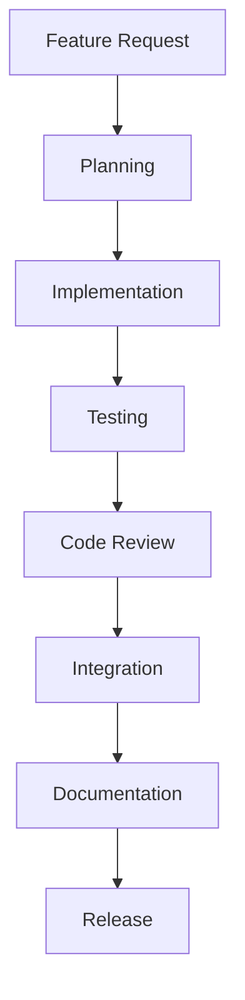
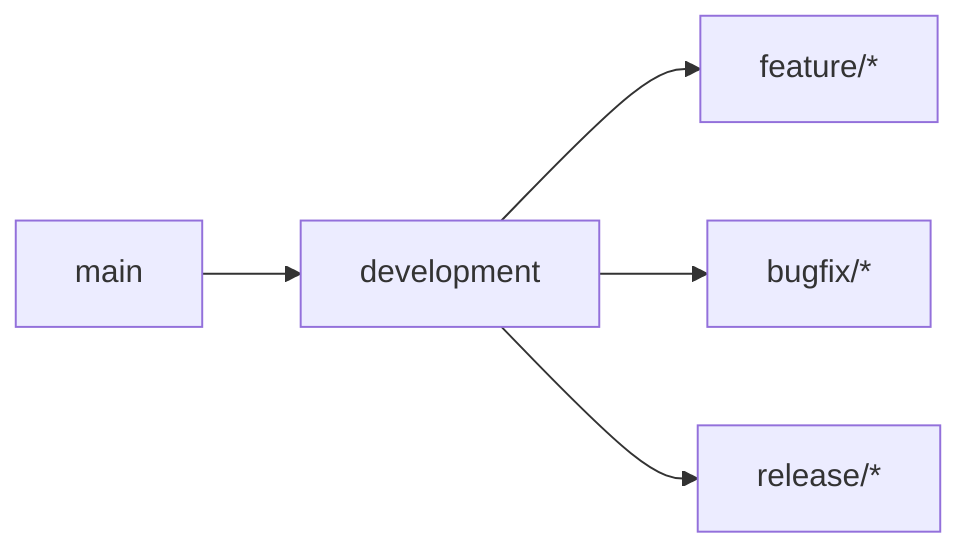
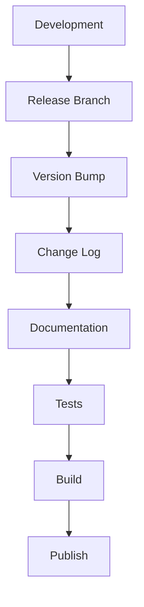

# Development Workflow

## Overview

This document outlines the development workflow for the FRAOP-MVI Dev Tools project. It covers the process from feature planning to release, including coding standards, testing requirements, and review procedures.

## Development Process

### 1. Feature Development



#### Steps:
1. **Feature Request**
   - Create issue in GitHub
   - Add appropriate labels
   - Assign to milestone

2. **Planning**
   - Technical specification
   - Architecture review
   - Task breakdown

3. **Implementation**
   - Follow coding standards
   - Write tests
   - Update documentation

4. **Testing**
   - Unit tests
   - Integration tests
   - Performance tests

5. **Code Review**
   - Peer review
   - Architecture review
   - Performance review

6. **Integration**
   - Merge to development
   - Integration testing
   - Regression testing

7. **Documentation**
   - API documentation
   - Usage examples
   - Update guides

8. **Release**
   - Version bump
   - Change log
   - Release notes

### 2. Branch Strategy



#### Branch Types:
- **main**: Production-ready code
- **development**: Integration branch
- **feature/***: New features
- **bugfix/***: Bug fixes
- **release/***: Release preparation

### 3. Commit Convention

```
<type>(<scope>): <description>

[optional body]

[optional footer]
```

#### Types:
- **feat**: New feature
- **fix**: Bug fix
- **docs**: Documentation
- **style**: Formatting
- **refactor**: Code restructuring
- **test**: Test addition/modification
- **chore**: Maintenance

## Code Standards

### 1. TypeScript Guidelines

```typescript
// Use interfaces for public APIs
interface ComponentProps {
  data: PropAnalysisResult;
  onUpdate?: (data: UpdateEvent) => void;
}

// Use type for internal types
type UpdateEvent = {
  timestamp: number;
  changes: Change[];
};

// Use enums for fixed values
enum AnalysisType {
  PERFORMANCE = 'performance',
  OPTIMIZATION = 'optimization',
  PATTERN = 'pattern'
}
```

### 2. Component Structure

```typescript
// Component file structure
import React from 'react';
import styles from './styles.module.css';
import { useAnalysis } from './hooks';
import { ComponentProps } from './types';

export const Component: React.FC<ComponentProps> = ({ data, onUpdate }) => {
  // Implementation
};
```

### 3. Testing Standards

```typescript
// Test file structure
describe('Component', () => {
  beforeEach(() => {
    // Setup
  });

  it('should render correctly', () => {
    // Test
  });

  it('should handle updates', () => {
    // Test
  });
});
```

## Review Process

### 1. Pull Request Template

```markdown
## Description
[Description of changes]

## Type of Change
- [ ] Bug fix
- [ ] New feature
- [ ] Breaking change
- [ ] Documentation update

## Testing
- [ ] Unit tests
- [ ] Integration tests
- [ ] Performance tests

## Checklist
- [ ] Code follows style guidelines
- [ ] Tests pass locally
- [ ] Documentation updated
- [ ] Change log updated
```

### 2. Review Checklist

#### Code Quality
- [ ] Follows TypeScript guidelines
- [ ] Proper error handling
- [ ] Efficient algorithms
- [ ] Clean code principles

#### Testing
- [ ] Test coverage > 80%
- [ ] Edge cases covered
- [ ] Performance tests pass
- [ ] Integration tests pass

#### Documentation
- [ ] API documentation
- [ ] Code comments
- [ ] Example usage
- [ ] Change log

## Release Process

### 1. Version Control



### 2. Release Checklist

#### Pre-release
- [ ] Version bumped
- [ ] Change log updated
- [ ] Documentation current
- [ ] All tests passing
- [ ] Performance verified

#### Release
- [ ] Build successful
- [ ] NPM package published
- [ ] GitHub release created
- [ ] Documentation deployed

#### Post-release
- [ ] Verify installation
- [ ] Monitor issues
- [ ] Update roadmap
- [ ] Plan next release

## Continuous Integration

### 1. GitHub Actions

```yaml
name: CI
on: [push, pull_request]
jobs:
  build:
    runs-on: ubuntu-latest
    steps:
      - uses: actions/checkout@v2
      - name: Install
        run: npm ci
      - name: Test
        run: npm test
      - name: Build
        run: npm run build
```

### 2. Quality Gates

#### Build
- All tests passing
- Code coverage > 80%
- No security vulnerabilities
- Performance benchmarks met

#### Review
- Two approving reviews
- All comments resolved
- Documentation updated
- Tests added/updated

## Support

### 1. Issue Management

#### Categories
- Bug reports
- Feature requests
- Documentation
- Questions

#### Priority Levels
- Critical: Production blocking
- High: Major functionality
- Medium: Non-critical features
- Low: Minor improvements

### 2. Response Times

#### Target Times
- Critical: 24 hours
- High: 48 hours
- Medium: 1 week
- Low: 2 weeks 